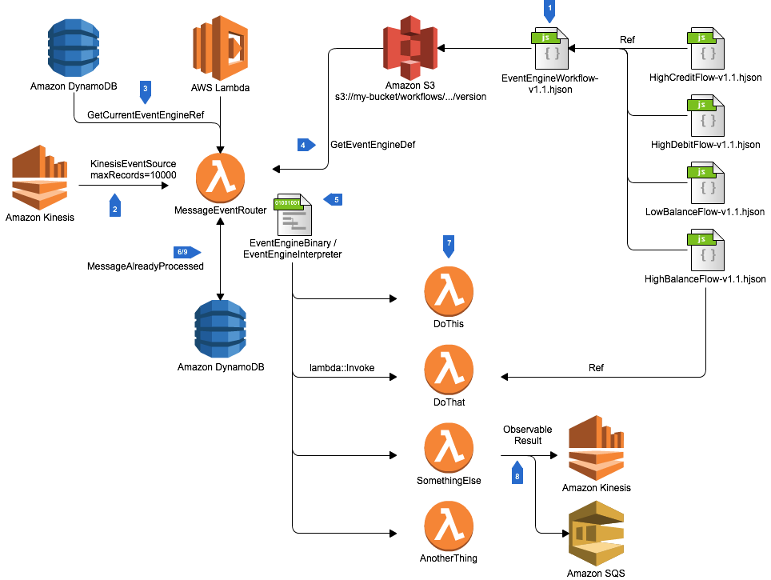

# Simple Dynamic Lambda Workflows on Kinesis Streams

This example project shows an architecture, and example implementation of a mechanism for creating dynamic workflows based on AWS Lambda invocations. This is a common requirements when you need to quickly build new applications using loosely coupled components and take advantage of serverless architecture. While the example code doesn't implement the full workflow, hopefully the steps to build a full architecture will be clear.

The key premise of this architecture is that you have a single MessageEventRouter Lambda function that is responsible for implementing the correct workflow for a given input message. These workflows are represented either as interpreted graphs of execution (as shown in the example code), or alternatively could be run as compiled binaries which are hot loaded based upon a rule set. This workflow is referred to as an EventEngine, which over time can be modified, versioned, and features such as incremental rollout supported.

The above logical architecture has the above main features:

1. Workflows are built dynamically using a secondary modelling tool or language. An example of this would be a client based tool that builds a workflow, where each workflow step is implemented as an AWS Lambda function. This is the model used in the [source example](src/main/resources/EventEngineGraph-v1.0.json). Alternatively, an event engine could be a reference to an AWS Step Functions entry point, an API Gateway call, or a compilable script using an interpreter (for example, a python script which is compiled and run through jython in a Java Lambda). These workflows may demonstrate arbitrary complexity for how they refer to their constituent components.
1. The MessageEventRouter Lambda function is created with a KinesisEventSource which maximises throughput, requesting a large number of messages in a single batch from an Amazon Kinesis Stream
1. On startup, the message event router queries a known, high performance data store such as DynamoDB to determine which EventEngine references should be loaded into memory, or compiled for later use. The MessageEventRouter should periodically re-check for changes to the Event Engine version which must be hot loaded.
1. Event Engine references stored in the datastore are just paths to files on Amazon S3. The reference is accessed with s3::GetObject, and the object metadata indicates what type of workflow is used. In this way, you could have execution graph based workflow, as well as interpreted binaries.
1. Once downloaded, the MessageEventRouter creates an in-memory cache (which is lazy loaded and hot swapped) for the entry point to the engine. This will allow for message based routing to the correct execution engine. An example of this using an HJson based workflow can be seen in [EventEngine.java](src/main/java/com/amazonaws/services/lambda/EventEngine.java).
1. When messages are received, they can be deduplicated against a data stored managed by successful completion of the MessageRouter flow for each message which is processed OK by the downstream workflow.
1. The compiled Event Engine binary or workflow is executed, and uses AWS Lambda InvokeSync or InvokeAsync API calls to implement the required workflow
1. Where required for the workflow, the called Lamba functions may create observable results such as writing data to other Kinesis Streams, creating SQS messages, or calling other API's. Because of this possibility, all invoked functions must be idempotent, as successful confirmation of execution from step 6/9 will not be guaranteed.
1. Once a message is successfully processed by the Event Engine workflow, it is written to the successful messages stored. Please note that this step may fail even though execution of the workflow has completed. Therefore the entire workflow should be considered 'at least once' execution.